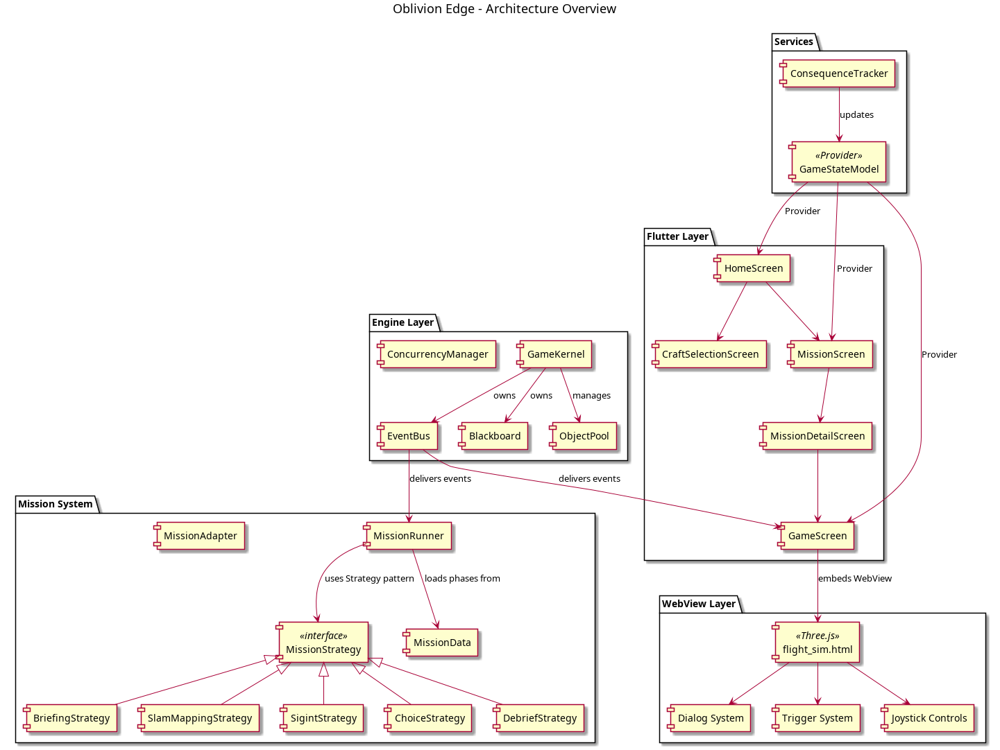
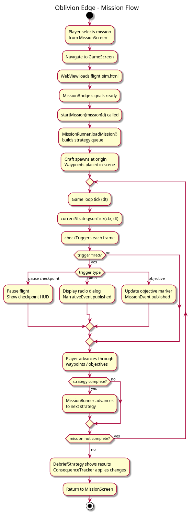
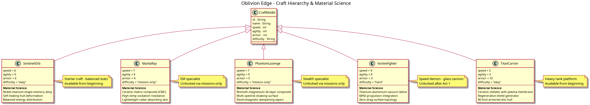
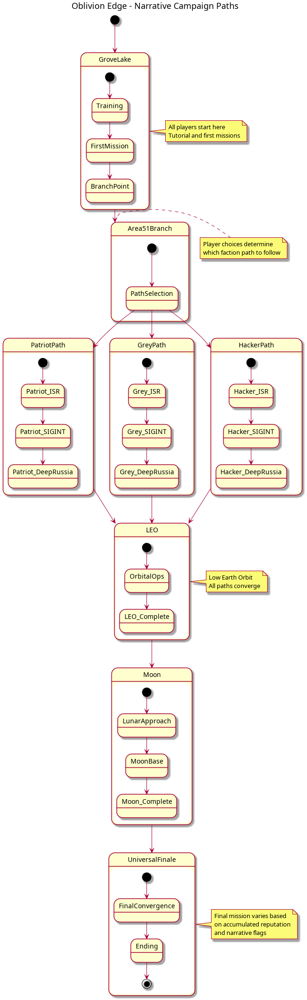

# Oblivion Edge: Flight Simulator

**A Grove Lake Aerospace Production**

> *"The real story is about human ingenuity and ambition, not aliens — but that's still incredible."*

---

## The Story

Somewhere in the Nevada desert, a dry lakebed stretches seven miles under restricted airspace. No roads lead here. No maps acknowledge it. But the tire marks on the alkali flat tell a different story — something has been landing here for decades, and it isn't commercial aviation.

You are a pilot — ambitious, skilled, and about to be recruited into something you cannot un-know. **Oblivion Edge** is a fictitious, fan-based narrative flight game inspired by the mythology of Area 51, the declassified history of programs like the U-2, SR-71, and F-117, and the extraordinary human ingenuity that made them possible. The premise is simple: what if the truth about classified aircraft programs was more interesting than any alien conspiracy?

The game begins at Grove Lake, a fictional test facility in the Nevada desert. You earn your wings flying exotic craft over sand and mesa, guided by a handler who calls himself Control. Each mission teaches you something real — about materials science, about signals intelligence, about the physics of flight at the edge of what's possible. And each mission pulls you deeper into a world where the line between patriotism and moral compromise grows thinner with every briefing.

Three campaign paths diverge based on the choices you make along the way, and each path explores a different facet of that moral complexity:

- **The Patriot** — Serve your country. Follow orders. Accept the cost. But late at night, when the radio is quiet and the stars are close, you'll wonder whether the mission was worth what it took from you.
- **The Grey** — Question authority. Dig deeper. The handler is hiding something, and the official story has holes you could fly a Titan Carrier through. The truth is out there, but knowing it comes with a price.
- **The Hacker** — Realize that code is more powerful than any airframe. Crack the encryption. Infiltrate the systems. Rewrite the rules of engagement from a terminal. The real battlefield was always digital.

No aliens. No anti-gravity conspiracies. Just titanium, ceramic composites, brilliant engineers, and the relentless question: *how far will you go?*

**DISCLAIMER:** This is ENTIRELY FICTITIOUS. Any resemblance to real classified programs is coincidental and flattering. Real-world inspiration comes from publicly available information about Area 51 history, declassified aircraft programs, and materials science research.

---

## Architecture Overview



Oblivion Edge is built on a layered architecture that separates the Flutter application shell from the Three.js flight simulation engine. This separation was a deliberate design choice — it allows the flight physics and mission scripting to evolve independently of the UI framework, and it means that iterating on flight behavior requires editing a single HTML file rather than recompiling the entire Flutter application.

### The Flutter UI Layer

The application shell is built with Flutter and uses the Provider pattern for reactive state management. At the center of this layer sits `GameStateModel`, a `ChangeNotifier` that holds all persistent game state: craft selection, telemetry readings, narrative flags, reputation scores across the three campaign paths, handler trust levels, and mission completion history. Every screen in the application — from the home screen to the mission select to the in-flight HUD — reacts to changes in this model automatically.

The `GameKernel` serves as the engine's lifecycle manager, initializing subsystems at startup and tearing them down cleanly on disposal. It provides two critical shared resources to all child widgets via Provider: the `Blackboard` (a shared key-value memory store that decouples systems from each other) and the `EventBus` (a typed publish-subscribe system that routes events between components without requiring direct references).

### The Three.js WebView Flight Simulator

The actual flight simulation runs inside a WebView that loads `assets/flight_sim.html` — approximately 1,800 lines of JavaScript that constitute the beating heart of the game. This single file handles everything that happens during flight: procedural Nevada desert terrain generated through noise-based vertex displacement, physics simulation with configurable parameters per craft variant, dual-joystick touch input rendered on a separate 2D canvas overlay, the mission checkpoint system with its dialog triggers, and atmospheric rendering with day/night cycle support.

The decision to use Three.js inside a WebView rather than a native 3D engine deserves explanation. Flutter's 3D support remains limited, and integrating a full game engine like Unity or Godot introduces substantial complexity in the build pipeline, platform-specific native code, and inter-process communication. The WebView approach trades a small amount of rendering performance for enormous gains in iteration speed — flight physics can be tweaked, tested, and hot-reloaded without touching Dart code at all.

### The JavascriptChannel Bridge

Flutter and the WebView communicate through a `JavascriptChannel` named `MissionBridge`. Rather than relying on the `onPageFinished` callback alone (which can fire before complex JavaScript has finished initializing), the system uses a handshake pattern that guarantees readiness.

The sequence works as follows. First, the WebView loads and initializes the entire Three.js scene — terrain, lighting, craft models, joystick system, and dialog overlays. Once everything is ready, the JavaScript code posts a `'ready'` message to the MissionBridge channel. Flutter receives this signal and responds by calling `window.startMission(missionId)`, which activates the correct mission script, spawns the appropriate craft model, places waypoints in the scene, and fires the initial checkpoint triggers. This handshake eliminates the race conditions that plague simpler WebView integration approaches.

### The Mission Engine and Strategy Pattern

Beneath the UI and flight simulation layers, the mission engine orchestrates the narrative experience using the Strategy pattern. The `MissionRunner` constructs a queue of `MissionStrategy` objects from the mission definition, then walks through them sequentially. Each strategy represents a distinct phase of gameplay with its own lifecycle hooks.

Five strategy types currently exist: `BriefingStrategy` handles mission introductions and intel presentations, `SlamMappingStrategy` implements Simultaneous Localization and Mapping gameplay, `SigintStrategy` manages signal intelligence collection mechanics, `ChoiceStrategy` presents narrative branching decisions with tracked consequences, and `DebriefStrategy` wraps up the mission with summary and rewards. Transitioning between strategies is a pointer swap — zero allocation, zero garbage collection pressure during gameplay.

### Event-Driven Communication

The `EventBus` ties everything together using typed ring-buffer channels with configurable capacity (defaulting to 64 events per channel). Each event type — `InputEvent`, `TelemetryEvent`, `MissionEvent`, `NarrativeEvent`, `SystemEvent` — flows through its own dedicated channel. When a consumer falls behind, the oldest events are silently dropped rather than building up a backlog. The game always processes the most recent state, which is exactly the right behavior for a real-time simulation.

The `Blackboard` complements the EventBus by providing shared key-value memory that any system can read or write. Strategies use the blackboard to communicate state (coverage percentages, waypoints remaining, signal strength) without holding direct references to each other. This loose coupling makes it straightforward to add new mission types without modifying existing code.

---

## Mission System



The mission system is the narrative backbone of Oblivion Edge, responsible for transforming a free-flight simulation into a structured storytelling experience. It operates across two coordinated layers: the Dart-side mission engine that manages strategy queues and consequence tracking, and the JavaScript-side trigger system that monitors flight state and fires dialog events in real time.

### Mission Definition: Two Layers, One Experience

Missions are defined in two places that must stay synchronized. On the Dart side, `MissionData` objects define the narrative structure: phases with briefings and educational content, choice points with branching consequences, reward values, and the metadata that the UI needs to display mission cards. On the JavaScript side, the `MISSIONS` object in `flight_sim.html` defines the flight-specific elements: checkpoint trigger conditions, waypoint coordinates in 3D space, altitude and time thresholds, and the exact dialog text that Control delivers during gameplay.

This dual definition exists because the two layers serve fundamentally different purposes. The Dart layer handles persistence, consequence tracking, and UI presentation — concerns that belong in the application framework. The JavaScript layer handles real-time flight monitoring, physics-coupled triggers, and frame-by-frame state evaluation — concerns that belong close to the simulation engine.

### The Checkpoint and Trigger System

Every mission is driven by checkpoints — events that fire when specific conditions are met during flight. The `checkTriggers()` function runs once per animation frame (approximately 60 times per second), evaluating each checkpoint's trigger condition against the current flight state.

The system supports several trigger types, each serving a different design purpose. The `start` trigger fires immediately when a mission begins, used for opening briefings and initial Control dialog. The `altitude>` trigger fires when the player exceeds a specified altitude threshold, enabling progressive difficulty and altitude-gated content. The `time>` trigger fires after a specified number of elapsed seconds, used to pace backstory exposition and ensure players hear Control's material science factoids even if they fly in circles. The `waypoint_` trigger fires when the player comes within 20 units of a named waypoint's 3D position, forming the backbone of navigation-based missions. The `hover_complete` trigger fires when the player maintains a specific position and velocity for a required duration, testing precision control.

Each trigger fires exactly once per mission — the system tracks fired triggers in a `Set` and skips any checkpoint whose key has already been recorded. This prevents dialog from repeating even though `checkTriggers()` runs every frame.

### Three Dialog Presentations

Not all mission communication is created equal, and the dialog system reflects this through three distinct presentation modes tailored to different narrative needs.

**Pause checkpoints** are full-screen overlays that halt the simulation entirely. The craft stops responding to controls, physics freezes, and the player's full attention is directed to the dialog panel. A typewriter effect renders Control's text character by character, and a CONTINUE button advances to the next checkpoint. These are reserved for major story beats — mission briefings, reveals, and the emotional moments that define the narrative arc.

**Radio communications** appear as a translucent bar at the bottom of the screen, styled to resemble a military communications intercept. They display for five seconds and dismiss automatically, and they do not pause the simulation. The player continues flying while Control's voice crackles through with backstory, tech specifications, or atmospheric commentary. Radio comms are queued — if multiple triggers fire simultaneously, each message waits for the previous one to finish before appearing.

**Objective banners** slide down from the top of the screen with a gold border, announcing the next task. They persist for four seconds and are replaced by subsequent objectives. These provide the player's immediate goal without interrupting gameplay flow.

---

## The Fleet



Every craft in Oblivion Edge is a love letter to materials science. The game's central thesis — that human engineering achievements are more extraordinary than any UFO conspiracy — is expressed most directly through the aircraft you fly. Each hull material is grounded in real science, extrapolated to the plausible edges of classified research. No handwaving. No unobtainium. Just what happens when you give brilliant engineers a black budget and tell them "impossible" isn't in the vocabulary.

| Craft | SPD | AGI | ARM | Hull Technology |
|-------|:---:|:---:|:---:|-----------------|
| **Sentinel Orb** | 6 | 6 | 6 | Nickel-titanium shape-memory alloy — deforms under stress, self-heals to original geometry. The Air Force wanted wings. The physics wanted a sphere. The NiTi remembered. |
| **XR-7 Manta Ray** | — | — | — | Ceramic matrix composite — silicon carbide fibers suspended in borosilicate glass matrix. The crystal structure only forms properly in microgravity. Every panel was manufactured in orbit. |
| **Phantom Lozenge** | — | — | — | Bismuth-magnesium layered composite — 26 alternating layers, each thinner than a human hair. Electromagnetic energy enters the structure and gets trapped between layers, re-emitted as heat on the opposite face. Radar sees nothing. |
| **Vortex Fighter** | 9 | 8 | 3 | Titanium-aluminium vacuum lattice — a continuous crystalline structure grown in a single pour. No joints, no fasteners, no seams. Gets *stronger* at Mach 2 as thermal expansion locks the lattice tighter. |
| **Titan Carrier** | 3 | 3 | 10 | Ceramic-metallic composite with plasma membrane — a high-voltage ionized gas field maintained 2mm above the skin. Scatters incoming radar and reduces cross-section to that of a hummingbird. Forty feet of armor, invisible. |

The Sentinel Orb and Vortex Fighter are available in free-flight craft selection. The Manta Ray, Phantom Lozenge, and Titan Carrier are mission-exclusive — you only fly them when the mission calls for their specific capabilities. This design choice reinforces the narrative progression: each new craft represents a deeper level of classified access.

---

## Campaign Paths



The narrative architecture of Oblivion Edge is built around three campaign paths that share anchor scenes but diverge dramatically in tone, mechanics, and moral framing. The choice system tracks reputation scores across three dimensions — Patriot, Grey, and Hacker — and uses these scores alongside handler trust levels and narrative flags to determine which missions are available and how characters respond to the player.

### Path 1: The Patriot

The Patriot path is the default first playthrough, and it tells the story of a pilot who believes in the mission. From Grove Lake's sunny desert training through Area 51's midnight briefings, from ISR reconnaissance over hostile territory to orbital operations at the cusp of space, the Patriot follows orders and trusts the chain of command. The moral weight accumulates gradually — each mission asks a little more, each briefing reveals a little less, and by the time the player reaches the Moon finale, the question isn't whether they served their country well, but whether their country deserved what it asked of them.

### Path 2: The Grey

Unlocked after completing the Patriot path, the Grey replays the same anchor scenes through the lens of suspicion. The flight tutorials are identical, but the radio chatter has inconsistencies. The handler's briefings have gaps. The Grey player notices what the Patriot player missed, and their choices — intercepting unauthorized communications, conducting independent intelligence gathering, building a network of allies who also question authority — reshape the narrative into a story about the cost of knowing the truth.

### Path 3: The Hacker

The Hacker path, unlocked after two complete playthroughs, reimagines the entire experience as a systems penetration exercise. Flight becomes secondary to code. The player spends as much time at ground station terminals as in the cockpit, cracking encryption, infiltrating orbital control systems, and discovering that the most classified secrets aren't protected by radar and concrete — they're protected by software. The Moon finale sees the player not as a pilot, but as a digital operative infiltrating the most classified AI system ever built.

**Current implementation status:** The Grove Lake arc (Missions 1–5) represents the opening chapter of the Patriot path. Five missions, five craft, and one handler named Control who has 22 years of stories to tell.

---

## Grove Lake Missions

The Grove Lake arc serves as the game's tutorial sequence, but it's designed to feel like anything but a tutorial. Each mission introduces new flight mechanics while advancing the narrative from "fresh recruit" to "cleared for Area 51." By the time the player completes Mission 5, they've mastered altitude control, precision waypoint navigation, night flight discipline, high-altitude operations, and perimeter patrol — and they've heard enough of Control's backstory to feel invested in whatever comes next.

| # | Mission | Craft | Difficulty | Objective |
|:-:|---------|-------|:----------:|-----------|
| 1 | Welcome to Grove Lake | Sentinel Orb | Easy | First flight over the Nevada desert — learn altitude and hover control |
| 2 | Canyon Run | Manta Ray | Medium | Navigate desert canyons at low altitude, hitting three precision waypoints |
| 3 | The Recruitment | Phantom Lozenge | Medium | Night ops — fly to a classified beacon below radar ceiling with no flight plan |
| 4 | Ceiling Test | Vortex Fighter | Hard | Push the Vortex to maximum altitude through three ascending waypoints |
| 5 | The Oblivion Protocol | Titan Carrier | Legendary | Final classified operation — perimeter patrol, sensor calibration, and a farewell |

The difficulty progression is deliberate. Mission 1 teaches vertical flight in the forgiving Sentinel Orb. Mission 2 introduces horizontal navigation and waypoint precision in the Manta Ray's blended wing body. Mission 3 adds the pressure of night flight and altitude discipline in the ghostly Phantom Lozenge. Mission 4 demands sustained climbing and spatial awareness in the speed-focused Vortex Fighter. And Mission 5 ties everything together in the heavy, deliberate Titan Carrier — proving that the player can fly anything, anywhere, under any conditions.

---

## Design Decisions and Trade-offs

The architecture of Oblivion Edge reflects a series of conscious trade-offs, each made in service of the project's primary goals: rapid iteration on flight mechanics, a compelling narrative experience, and a build pipeline simple enough to be managed by a small team.

### WebView over Native 3D

The most significant architectural decision is the use of Three.js inside a WebView rather than a native 3D engine. This choice trades rendering performance (WebView introduces an additional compositing layer and JavaScript execution overhead) for iteration speed that would be impossible with a compiled engine. Flight physics, terrain generation, craft models, and mission scripts all live in a single HTML file. Changing a drag coefficient, adding a mesa, or rewriting a dialog line requires editing text and refreshing — not recompiling, relinking, and redeploying.

This trade-off is viable because the flight simulation's visual complexity is moderate. Procedural terrain, simple geometric craft models, and particle effects are well within what Three.js can render at 60fps on modern mobile hardware. If the project eventually requires photorealistic rendering or complex physics, this decision would need to be revisited.

### The JavascriptChannel Handshake

Early implementations used `onPageFinished` to inject mission data into the WebView, but this proved unreliable — the callback can fire before complex inline JavaScript has finished executing, particularly on slower emulators. The `MissionBridge` channel handshake adds a small amount of complexity (a few lines on each side) but eliminates an entire class of timing bugs. The page signals when it's genuinely ready, and Flutter responds only then.

### Touch Event Architecture

The dual-joystick system calls `e.preventDefault()` on `touchstart` to suppress the browser's default touch behaviors (scrolling, zooming, text selection) that would interfere with flight controls. This works perfectly for gameplay, but it also prevents touch-to-click synthesis — meaning that tapping a button in a dialog overlay does nothing.

The solution is a conditional check: when `dialogState.paused` is true, the touch handler skips `preventDefault()` and instead uses `document.elementFromPoint()` to find the touched element and fires `.click()` on it directly. This gives dialogs full touch interactivity while keeping joystick input clean during flight.

### Strategy Pattern for Mission Phases

The `MissionRunner`'s strategy queue was chosen over alternatives like a state machine or scripted coroutines because it offers the cleanest extension path. Adding a new mission phase type — say, a dogfight phase or a hacking minigame — requires implementing four methods (`onEnter`, `onTick`, `onEvent`, `onExit`) in a new class and registering it in the phase-to-strategy mapping. No modifications to existing code. No risk of breaking working missions.

### Procedural Desert Terrain

The Nevada desert is generated entirely through math — a `noise2D` function displaces vertices on a subdivided plane to create rolling hills, and a flat lakebed is carved out of the center by blending heights toward a constant elevation within a defined radius. Mesas are simple box geometries with flat caps placed at random positions beyond the lakebed perimeter. Vertex colors provide the sandy tan, alkali white, and brown earth tones without requiring any texture files.

This approach keeps the APK small (no texture assets to bundle) and allows terrain variation per mission if needed in the future. The trade-off is visual fidelity — the terrain reads as "desert" from flight altitude but wouldn't hold up to close inspection on foot.

### Ring-Buffer Event Bus

Fixed-capacity ring buffers were chosen over unbounded queues or callback systems because they provide predictable memory behavior. Each event channel allocates its buffer once at initialization and never again. If a consumer can't keep up with producers, the oldest events are dropped — which is exactly the right behavior for a real-time simulation where stale input is worse than no input.

---

## Known Limitations

Every project has boundaries, and being honest about them is more useful than pretending they don't exist. The following limitations are known, documented, and in most cases represent deliberate scope decisions rather than oversights.

**Performance variability.** WebView rendering performance varies significantly across Android devices. Modern devices (2021+) maintain 60fps consistently, but older hardware or low-memory emulators may drop frames during complex scenes with many waypoints or particle effects. Profiling on target hardware is recommended before adding visual complexity.

**No persistent save state.** Mission progress, reputation scores, and narrative flags are held in memory and reset when the app restarts. Implementing persistence (likely via `shared_preferences` or a local SQLite database) is a prerequisite for the multi-path campaign system but was deferred to keep the Grove Lake arc focused on flight mechanics.

**Waypoint proximity detection.** Waypoints trigger when the player comes within 20 units of the target position, measured by simple Euclidean distance. This works well in open desert but can feel imprecise near terrain features or when approaching at high speed. A future improvement might use a velocity-adjusted trigger radius or a frustum-based approach.

**Night mode limitations.** Toggling between day and night changes the sky gradient, fog density, and star visibility, but does not affect shadow maps or dynamic lighting. Headlights, searchlights, and facility lights would significantly enhance the night missions but require additional Three.js setup.

**Test script timing.** The ADB-driven test scripts use `sleep` commands to wait for animations, dialog typewriter effects, and flight physics to reach expected states. These timings were calibrated for a specific emulator configuration and may need adjustment on faster or slower hardware.

**Scope.** Only the Patriot path's Grove Lake arc is implemented — 5 of an estimated 30 missions across all three campaign paths. The mission engine, consequence tracker, and narrative branching system are architecturally complete but await content.

**Audio.** There is no audio or sound effects implementation. Engine sounds, radio static, Control's voice, wind noise, and atmospheric music would dramatically enhance immersion but represent a significant content creation effort.

---

## Materials Science Factoids

The factoids that Control weaves into mission briefings aren't invented. They're drawn from real materials science, real aircraft history, and real engineering achievements — because the truth, as Control likes to say, is more interesting than fiction.

**Shape-memory alloys** are commercially produced and widely used. Nickel-titanium (Nitinol) undergoes a reversible phase transition between martensite and austenite crystal structures, allowing it to "remember" and return to a pre-programmed shape after deformation. Medical stents, satellite deployment mechanisms, and aircraft actuators all exploit this property. The Sentinel Orb's self-healing hull is an extrapolation of existing NiTi technology to structural scales.

**Ceramic matrix composites** protect the hottest parts of jet engines. Silicon carbide fibers embedded in a glass or ceramic matrix maintain structural integrity above 1,300°C — temperatures where nickel superalloys begin to soften. The Space Shuttle's wing leading edges used reinforced carbon-carbon composite for the same reason. The Manta Ray's hull material is real in composition; only the microgravity manufacturing is speculative.

**Bismuth compounds** exhibit genuinely exotic physics. Bismuth telluride (Bi₂Te₃) is the most commercially successful thermoelectric material, and bismuth-based topological insulators — materials that conduct electricity on their surfaces while remaining insulating internally — are an active frontier of condensed matter research. The Phantom Lozenge's 26-layer waveguide is extrapolated from real layered bismuth structures and their interaction with electromagnetic radiation.

**Magnetohydrodynamic propulsion** was demonstrated in 1992 when Japan's Yamato 1 became the first ship propelled by an MHD drive — using superconducting magnets to accelerate seawater electromagnetically. The technology produces zero noise and has no moving parts. Scaling MHD to air vehicles (where the working fluid is ionized air rather than saltwater) is an engineering challenge that multiple research groups are actively pursuing. The Vortex Fighter's "closed-cycle MHD system" is speculative but grounded in real physics.

**Plasma actuators** are real devices being tested at NASA Langley Research Center, DARPA, and universities worldwide. Dielectric barrier discharge (DBD) actuators generate a thin layer of plasma on an airfoil surface, energizing the boundary layer to delay flow separation, reduce drag, and increase lift. They weigh effectively nothing, have no moving parts, and consume modest electrical power. The Titan Carrier's plasma membrane shield extends this concept from boundary-layer control to full-surface radar management.

**The SR-71 titanium story** is declassified fact. In the early 1960s, the Soviet Union was the world's primary source of titanium ore. The U.S. government established front companies and shell corporations to purchase Soviet titanium, which was then shipped to Lockheed's Skunk Works in Burbank, California, where it was forged into the airframes of the SR-71 Blackbird — the aircraft that would spend the next two decades conducting reconnaissance flights over Soviet territory. The Soviets literally supplied the raw material for the plane that spied on them.

**The F-117 Nighthawk's radar cross-section** of approximately 0.001 m² (roughly the return of a steel marble) was achieved through faceted geometry that scattered radar energy in directions other than back toward the receiver. The shape was so aerodynamically unstable that it required a quadruple-redundant fly-by-wire computer making 40 corrections per second to maintain controlled flight. Without the computers, it flew like a refrigerator. With them, it was invisible.

---

## Build and Test

Building and testing Oblivion Edge requires a Flutter development environment configured for Android and a connected device or emulator. The test suite uses ADB (Android Debug Bridge) to automate touch input and verify mission flow.

### Quick Start

```bash
# Build and deploy to connected emulator/device
./tests/compile_and_hotload.sh

# Run all 5 mission tests sequentially
./tests/run_all.sh

# Run a single mission test
./tests/start_and_compile.sh 3 && ./tests/mission_3.sh

# Skip rebuild if already installed
./tests/run_all.sh --skip-build
```

### Prerequisites

- Flutter SDK at `~/develop/flutter_linux_3.44.6-stable/flutter/`
- Android emulator running (API 33+ recommended for WebView compatibility)
- ADB connected and authorized (`adb devices` shows your device)
- Declarative Gradle setup (configured in `android/settings.gradle`)

### Iterating on Flight Physics

One of the primary advantages of the WebView architecture is the ability to modify flight behavior without recompiling the Flutter application. To iterate on physics, terrain, dialog, or mission scripts, edit `assets/flight_sim.html` directly and rebuild:

```bash
./tests/compile_and_hotload.sh
```

Changes to the HTML file take effect on the next app launch. For the fastest iteration cycle, use Flutter's hot restart from your IDE — though a full rebuild via the script guarantees a clean state.

---

## Project Structure

```
lib/
├── engine/           — Game kernel, event bus (typed ring-buffer channels),
│                       object pool, concurrency manager
├── missions/         — Mission runner (strategy queue), phase strategies
│   ├── strategies/     (briefing, SLAM, SIGINT, choice, debrief)
│   └── data/           Mission data definitions (Manta Ray ISR)
├── models/           — GameStateModel (Provider), MissionData, CraftModel,
│                       Blackboard (shared key-value memory)
├── screens/          — Home, craft selection, mission select,
│                       mission detail, game (WebView host)
├── services/         — Consequence tracker (reputation, trust, narrative flags)
├── theme/            — Oblivion dark theme (cyan / gold / orange palette)
└── widgets/          — HUD overlays: SLAM coverage, SIGINT strength,
                        choice panel, joystick indicators
assets/
└── flight_sim.html   — Three.js flight simulator (~1,800 lines)
                        Procedural terrain, craft physics, mission triggers,
                        dual-joystick input, checkpoint dialog system
tests/                — ADB-driven mission test scripts
                        Per-mission validation, compile/hotload, speed run
docs/                 — PlantUML architecture and design diagrams
```

---

## Credits

**OBLIVION EDGE VULNERABILITY RESEARCH LLC (C) 2226**

Built with Flutter, Three.js, and a deep appreciation for the engineers who spent their careers in windowless hangars building machines that shouldn't exist — and then never told anyone.

> *"The future of humanity is not written by governments or hackers or patriots alone. It's written by all of us — with ambition, with ingenuity, with difficult choices. May we see the stars again. May we do better. Peace. Love. Prosperity. The cosmos awaits."*

---
